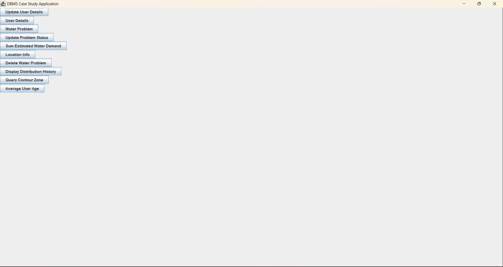
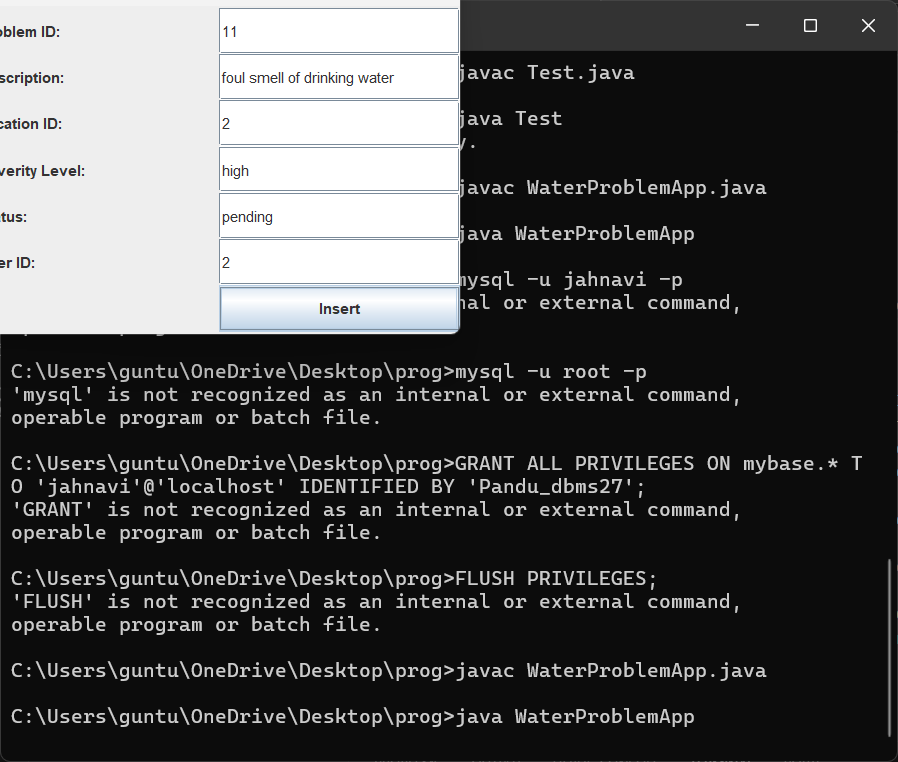
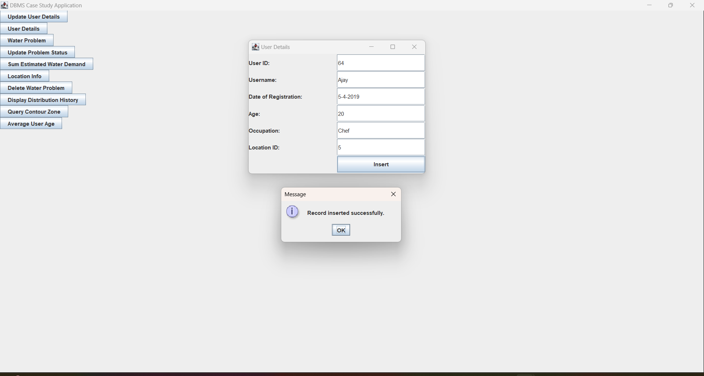
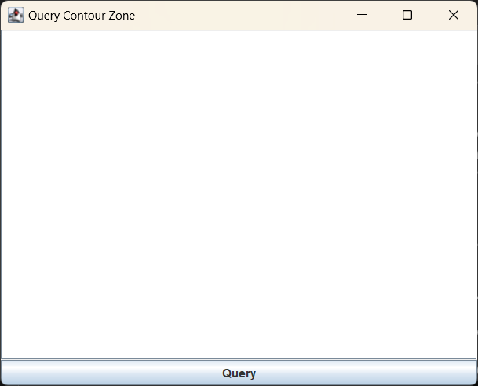

# 💧 Water Related Problem Case Study

A desktop-based application built using **Java Swings** for the frontend and **MySQL** for the backend to manage and monitor water-related civic issues. This tool helps authorities and users log, update, and resolve problems related to water infrastructure in their localities.

---

## 🚀 Features

- 📝 Add new water-related complaints
- 🔎 View, update, and delete existing problems
- 🧑 View and manage user details
- 📨 Handle general queries separately
- 🛢️ Integrate with a MySQL database for persistent storage

---

## 🛠️ Tech Stack

| Component    | Technology        |
|--------------|-------------------|
| Frontend     | Java Swings       |
| Backend      | MySQL             |
| Language     | Java              |
| Version Ctrl | Git + GitHub      |

---

## 🖼️ Screenshots

All screenshots of the UI and DB interactions are available inside the `screenshots/` folder.

| Description               | Image                                                                            |
|---------------------------|----------------------------------------------------------------------------------|
| 🏠 Home Page              |             |
| 📋 Water Problem Listing  |  |
| 👤 User Details           |       |
| 🧾 DB Query Sample        |             |

---

## 📂 Folder Structure

```

water\_related\_problems\_case\_study/
├── screenshots/
│   ├── \*.png
│   └── checking\_DB/
│       ├── \*.png
|
|── Main.java
│── DBConnection.java
│── ProblemForm.java
│── ...
├── README.md
└── ...

````

---

## 🧑‍💻 How to Run

1. Clone the repository:
   ```bash
   git clone https://github.com/Jahnavi-2723/Water-Related-Problem-Case-Study.git
   cd Water-Related-Problem-Case-Study
````

2. **Setup the MySQL database:**

   * Create a database (e.g., `water_issues`)

3. **Compile and run the Java application:**

   ```bash
   javac -d bin src/*.java
   java -cp bin Main
   ```

4. Make sure your DB credentials (host, user, password) are correctly set in your `DBConnection.java`.
````
---

## 📬 Contact

* 👩‍💻 **Developer**: Jahnavi Guntuboina
* 📧 Email: [guntuboinajahnavi@gmail.com](mailto:guntuboinajahnavi@gmail.com) 
* 🌐 GitHub: [@Jahnavi-2723](https://github.com/Jahnavi-2723)

---

## 📄 License

This project is for academic and demo purposes only. Not intended for production use.
